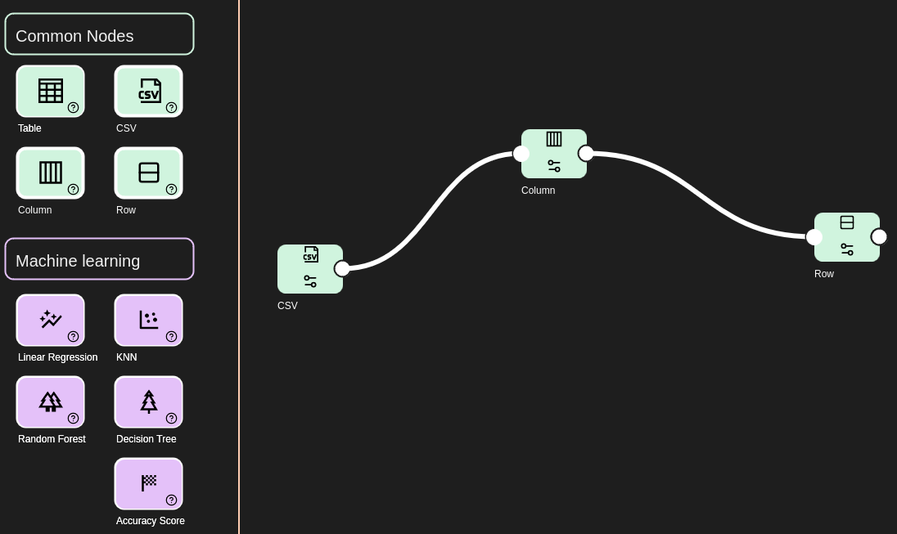

## MLResourcePool, An Machine Learning Tool Prototype With Resource Sharing

MLResourcePool is an ML tool designed to work remotely through a browser, it is a full stack application developed using NextJS Framework, Docker containers and Python with FastAPI. It Uses Sci-kit Learn Machine Learning Library for model training. 

## Screenhot

More screenshots are in /preview folder

 

